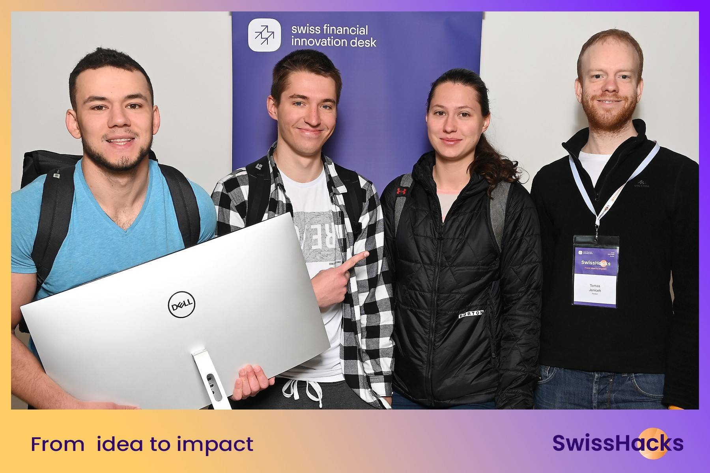

# 3plus1 at SwissHacks 2025 - Winning solution

SwissHacks 2025 took place on April 11-13, 2025, in Zurich, with 54 great teams competing.

Our team took home:

- 🥇 The Overall Winner title
- 💼 The Julius Baer Challenge
- 🎉 The Audience Prize



## Monorepo structure

A monorepo containing:

- `frontend`: Next.js + React + TypeScript web application
- `backend`: Python FastAPI backend
- `scripts`: Python analytical scripts
- `docker`: Docker configuration files
- `terraform`: AWS infrastructure as code

[](https://github.com/user/swisshacks/actions/workflows/deploy.yml)

## Getting Started with Docker

The easiest way to run the entire application locally is with Docker Compose:

```bash
# Build and start all services in development mode
docker compose up -d

# View logs
docker compose logs -f

# Stop all services
docker compose down
```

Once running, you can access:
- Frontend: http://localhost:3000
- Backend API: http://localhost:8000/api/v1
- API Documentation: http://localhost:8000/api/v1/docs
- In production, both frontend and API are accessible via the same CloudFront URL
- PostgreSQL Database: localhost:5432 (username: postgres, password: postgres, database: swisshacks)

## Manual Setup

### Frontend

```bash
cd frontend

# Install dependencies
npm install

# Run development server
npm run dev
```

### Backend

```bash
cd backend

# Create and activate virtual environment
python -m venv venv
source venv/bin/activate  # On Windows: venv\Scripts\activate

# Install dependencies
pip install -r requirements.txt

# Run development server
uvicorn app.main:app --reload
```

### Scripts

```bash
. .env

cd scripts

# Create and activate virtual environment
python -m venv venv
source venv/bin/activate  # On Windows: venv\Scripts\activate

# Install dependencies
pip install -r requirements.txt

# Run a script
python analyze_data.py
```

## Deployment

This project is configured with GitHub Actions for CI/CD:

1. Pull requests to `main` branch trigger a Terraform plan
2. Merges to `main` branch trigger automated deployment to AWS:
   - Backend deployed to ECS Fargate
   - Frontend static files built and deployed to S3/CloudFront

### Required GitHub Secrets

For CI/CD to work properly, add these secrets to your GitHub repository:

- `AWS_ACCESS_KEY_ID` - AWS access key
- `AWS_SECRET_ACCESS_KEY` - AWS secret key
- `DB_USERNAME` - Database username
- `DB_PASSWORD` - Database password

## Infrastructure

The AWS infrastructure is provisioned using Terraform:

- VPC with public and private subnets
- ECS cluster running the containerized backend application
- RDS PostgreSQL database
- ECR for container images
- Load balancer for API traffic routing
- S3 bucket for hosting static frontend files
- CloudFront distribution for global delivery of frontend assets and API proxying
- IAM user with deployment permissions
- Optional GitHub Actions OIDC provider for keyless authentication

### Manual Terraform Deployment

```bash
cd terraform
cp terraform.tfvars.example terraform.tfvars
# Edit terraform.tfvars with your values

terraform init
terraform plan
terraform apply
```
